# Process and Process Management

- What is a process? 
- How are processes represented by the OS?
- How are multiple concurrent processes managed by the OS?

### Visual Metaphore: Process

Process is like an order of toys:
- state of execution
    - completed toys waiting to be built
    - in progress toys
- parts and temporary holding area
    - plastic pieces, containers, etc.
- may require special hardware
    - sewing machine
    - glue gun
    - nail gun

---

OS Process:
- state of execution
    - program counter
    - stack
- parts and temporary holding area
    - data
    - register states living in memory
- may require special hardware
    - I/O devices
    - control which processes that are running concurrently get access to the special hardware/what order that is queued in

### What is a Process?

**OS manages hardware on behalf of applications**

Application: program on disk, flash memory, stored in the cloud
    - static entity

Process: state of a program when executing, loaded into memory
    - active entity

*If the same application is launched more than once there are multiple processes*

Think about multiple instances of a text editor editing different files.
    - they have separate execution states and respective data

## Process anatomy

Types of state
- Text and data
    - static state when process first loads

- heap
    - dynamically created during execution
    - may not be contiguous chunk of memory in practice
    - can grow over process lifetime

- stack
    - grows and shrinks during process lifetime (as well)
    - LIFO

### What does a Process "look like"?

- Address space
    - "In Memory" representation of a process
    - are between `V_0` and `V_max`
    - Virtual addresses
    - Used by processes to reference program state
    - "Virtual" because they don't have to refer to the physical location of memory in RAM
        - instead, we use Page Tables to map the virtual address to physical address
- Page tables
    - mapping of virtual to physical Address
    - decouple the layout of the data in the stackframe (stack, heap, data, text), and the layout in actual physical memory (RAM)
        - can be complex
        - varry greatly between processes
    - keeps physical memory layout simplier because its not at all dictated by the data layout of the actual processes executing/users of said data space.
- Physical address
    - locations in physical memory
    - DRAM
    - as long as the mapping between virtual memory and physical memory is *present* in the page table (a valid page table entry exists), any access to the program's local variable will access the underlying physical address of the respective variable's data

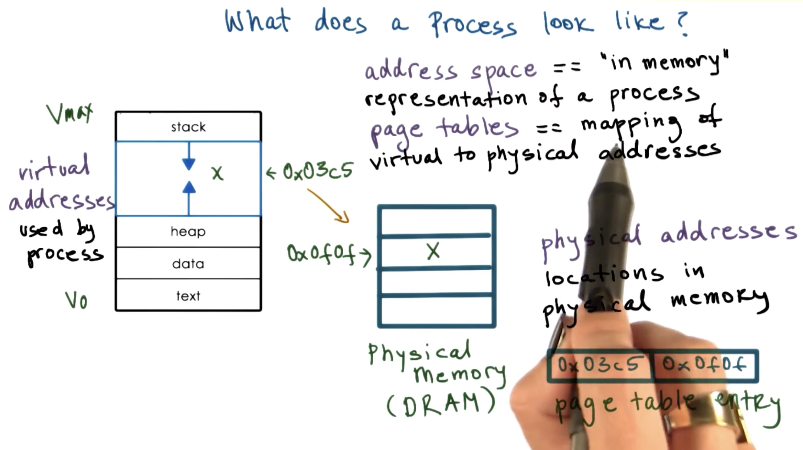

#### Example

Page Table entry: `0x03c5 --> 0x0f0f`, data may live at `0x03c5` in the virtual address space and this may map to `0x0f0f` in physical memory.

#### SWAP Space

32bit addresses -> 4GB, because of this, the OS decides dynamically which portion of which address space are stored in physical memory.

The processes can partionally be stored in memory with pointers to the rest of the process memory stored in SWAP space on disk.

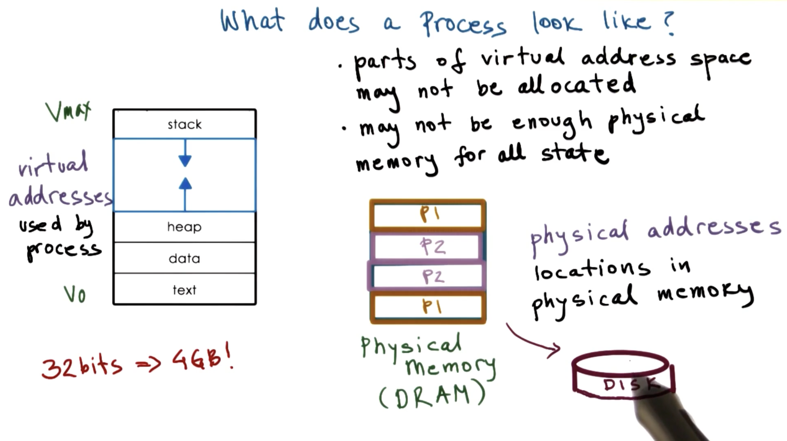

Operating Systems maintain the information where the virtual addresses actually are, whether its in memory or on disk because, it maintains the mapping between the virtual addresses and the physical memory location for everything within the memory address space.

#### Address Space

2 Processes: P1, P2, can have the exact same virtual address space size. It is up to the Operating System to maintain the location of each piece of data per process.

The operating system maintains the mapping from a given virtual address to the physical address location.

# Quiz 1

If tow processes `P1` and `P2` are running at the same time, what are the *virtual address space* ranges they will have?

- `P1`: 0-32000,  `P2`: 32001-64000
- `P1`: 0-64000,  `P2`: 0-64000
- `P1`: 32001 - 64000,  `P2`: 0 - 32000

### Answer

- `P1`: 0-64000,  `P2`: 0-64000

## How does the OS Know what a Process is doing?

OS **MUST** know what a process was doing so that when its stopped, it must be able to resume
the process from the exact same point, as if nothing had happened to the process.

Each process thinks that it is being ran continuously from beginning to end of execution 
on the CPU, when in reality it is scheduled, ran, stopped constantly until it is finished.

**How does the OS know what a process is doing?**

*example code: https://s3.amazonaws.com/content.udacity-data.com/courses/ud923/notes/ud923-p2l1-loop-code-example.png*

When a program is compiled, it gets translated to bytecode/binary (as an executable) sequence of instructions. At **ANY** time the CPU has a "PC" or Program Counter to keep track of where exactly in the instruction set the program is.

The **Program Counter** is maintained on the CPU while the process is executing in a register.

There are registers on the CPU that maintain certain data about the program while its running. These values maintained in the registers are necessary during the execution of the process. May contain:
- Addresses for data
- Status information that can affect execution of certain sequences

Registers are considered to be apart of the sate of the process. Additionally, the **Process Stack** is also apart of the program state. The top of the stack is maintained by the **Stack Pointer** (LIFO behaivor).

OS Maintains Information about:
- Program Counter
- CPU Registers
- Stack Pointer

All of this information isn maintained in a PCB: Process Control Block.


## PCB: Process Control Block

The PCB is a data structure that the operating systems leverages and maintains throughout the lifetime of any given process.

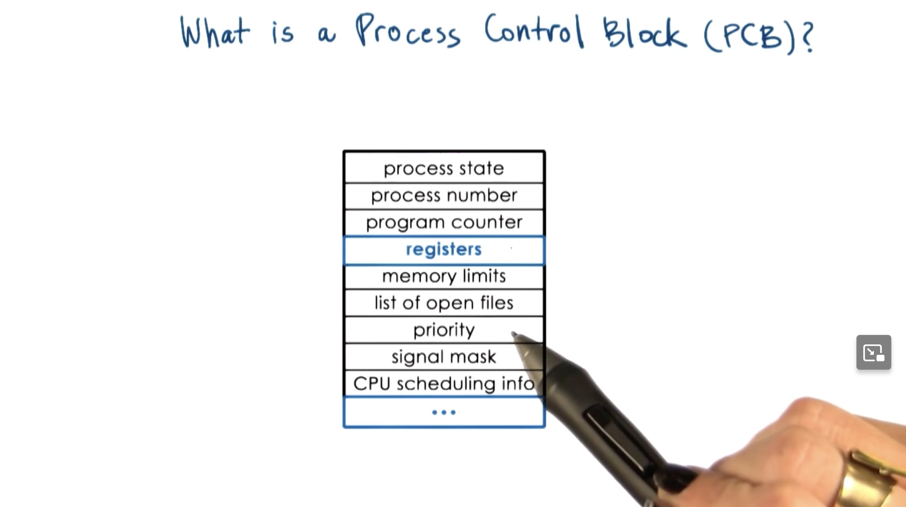

- **PCB in created and initialized when a process is created.**
- Certain fields are updated whenever the process state changes.
    - when a process requests more memory, the OS will allocate more meory and establish new virtual to phews coal memo mappings for this process.
    - this will reflect in the memory limits as well as the information regarding valid virtual addressing space for process.
- Other fields change too frequnelty
    - OS's job to collect and save all the information that a CPU uses during the process and save and maintain it in the PCB whenever this PCB is no longer in use 
        - (process gets pulled off the CPU by scheduler)

For some data fields with the PCB data structure are updated extremely regularly, like the PC or program counter changes when each instruction is executed on the CPU. We **do NOT** want to update the PC after each instruction execution as that will create a lot of overhead/bookkeeping.

Instead, the CPU has a dedicated register which is uses to track the current PC for the current executed process. The register will get updated after each instruction is executed in the process.

### How is PCB used?

Whenever a process is done executing on a CPU (and has not finished yet), it will save the PCB for the given process. When the new process is loaded it will restore it's respective PCB onto the CPU to resume the execution.

### Context Switching

When a process is switched from one to another, it will create an **interrupt** on the running process: `P1`, then save all the state information contained in the PCB for `P1`. When the CPU scheduler pulls the new process `P2` onto the CPU the OS must restore the `P2` respective PCB, this is called **Context Switching**

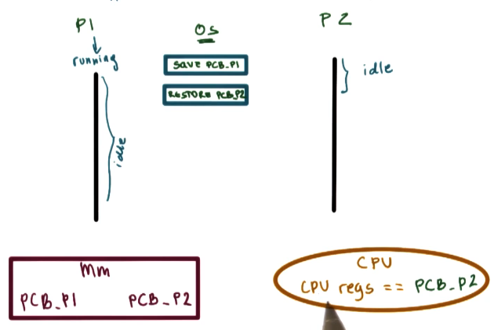

**TLDR;** *Switching the CPU from the content of one process to the content of another process*

#### Why is Context Switching Expensive?

- Direct Costs: number of cycles for load and store instructions (to and from memory)
    - Number of cycles for load 2 store instructions
- Indirect costs: Process A running on CPU, a lot of data is sotred in the processor cache, when we switch, and P2 is loaded, we will see a lot of cache misses because their data is completely different. Accessing CPU cache is much faster than memory, there is a hierarcical cache, 3 levels of varying size and speed.
    - COLD Cache
    - Cache misses

*Modern CPU's have a hierarchical cache L1, L2, L3 each subsequent cache is larger but slower than the previous cache. This can optimize cache speeds for hot items and mitigate the impact on cache misses because it may be present in one of the higher cache levels instead of retrieving from system memory*

Cache is **HOT** in the middle of process, when we context switch, we will have a **COLD** cache, because we have to spend a lot of time to read data from memory. Running with a cold cache will require longer data acess time which will slow the process.


# Quiz 2

For the following sentence, check all options that correctly complete it:
When a cache is hot ...

- it can malfunction so we must context switch to another process
- most process data is in the cache so the process performance will be at its best
- sometimes we must context switch

### Answer

- most process data is in the cache so the process performance will be at its best
- sometimes we must context switch

## Process lifetime

A process can be in 1 of 2 states: **Running** or **Idle**.

- When a processing running, it can be interrupted by a context switch. It transitions to the ready state, meaning that its ready to be scheduled on the CPU for processing again.

- When a process if Idle/Ready, it can be scheduled. A context switch will place the Idle/Ready scheduled task back on the CPU for processing.

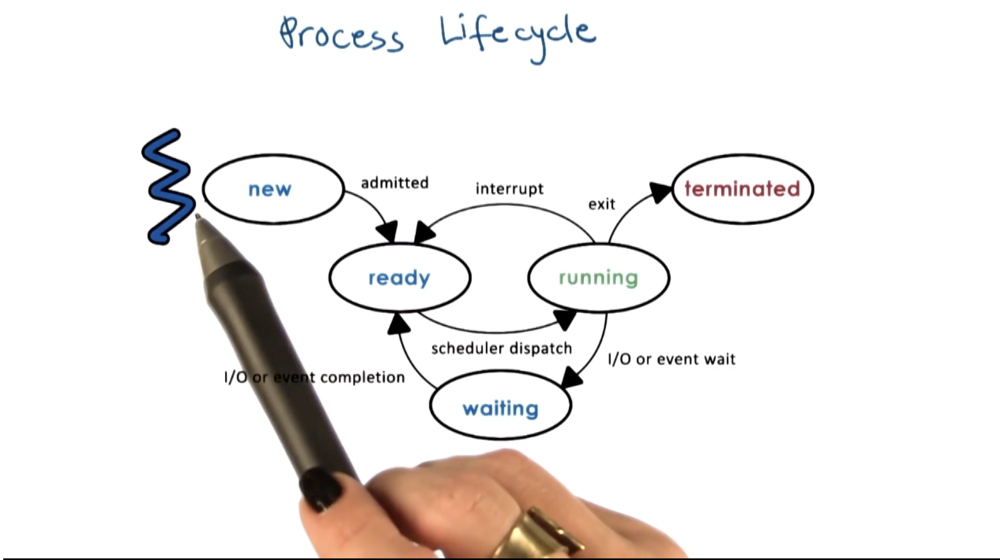

- When a process spawns, the OS allocates resources, when the resources are available, the process is **admitted** and is in the **Ready** state, ready to be scheduled.
- When a process is in the **Ready** state, it is ready to be processed on the CPU. A **Ready** process must wait for the OS Scheduler to schedule its time/turn on the CPU.
- **Scheduler Dispatch** transitions a ready process into the **Running** state.
    - A **running** process can be processed until a context switch occurs, where the OS will interrupt the process to carry out the context switch
        - After the process has been context switched, it will transition back into the **Ready** state
    - Sometimes, a process may need to wait for some long running event
        - Querying data from storage
        - Waiting on I/O from keyboard
    - The process enters a **Watiing** state
    - When the **Waiting** is finished, (the event has occured) the process enters the **Ready** state again

- When all operations in the program has finished, or when the process encoutners an error, it returns the respective exit code: success, error, and the process is terminated.

# Quiz 3

The CPU is able to execute a process when the process is in which state(s) ?

- Running
- Ready
- Waiting
- New

### Answer

- Running
- Ready

## Process Creation

*A process can create child processes*

Most operating systems after it has been loaded by the boot loader, it will create some **initial processes**.
- When a user logs into said system, a *user shell process* is spawned as a child process on the operating system.
- As the user types in commands, these will be spawned in as child processes from the User's session.

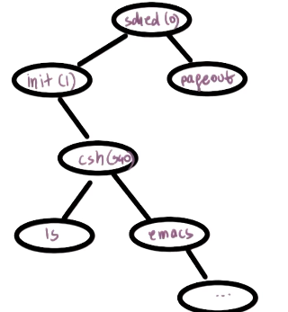

*larger image here: https://s3.amazonaws.com/content.udacity-data.com/courses/ud923/notes/ud923-p2l1-process-tree.png*

Mechanisms for process Creation

- Fork
    - copies the parent PCB into a new child PCB
    - child contrinues execution at instruction (PC) after fork
    - Both the parent and child have the same PCB
- Exec
    - replace child image
    - load new program and start from first instruction
    - The child PCB will have values for the new program

### Control Flow

- The parent process creates a child by calling "Fork"
- "Fork" will copy the parent PCB to the child process (both processes now have identical PCBs)
- Child continues execution at instruction after fork
- Then calling "Exec" to replace the PCB with the relevant program/application data required
for the respective program/application to execute

**The process of creating a new process is by calling "Fork", to spawn the new process, then calling "Exec" to replace child image with the PCB with the relevant program/application data required for the program to execute**

# Quiz 4
On Unix based OS, which  process is regarded as "the parent of all App processes"? ___

On the Android OS, which process is regarded as "the parent of all App processes"? ___

### Answer

- `init`
- `zygote`

## What is the role of the CPU Scheduler?

- There are multiple processes waiting in the ready queue.
- Which process do we choose to execute on the CPU?

*CPU Scheduler is an OS component that manages how the processes use the CPU resources*
    - Decides which process in the ready queue is dispatched to the CPU to use the resources
    - Determines how long each process will run on the CPU

**Preempt**: interrupt and save current context (preemption)
**Schedule**: run scheduler to choose next process
**Dispatch**: Dispatch process and switch into its context

Scheduler makes sure that the CPU time is spent running Processes instead of running scheduling algorithms. Its important ot have efficeint design and implementations within the scheduling process and efficient data structures involved in queuing processes in the ready state.
    - how long did processes run in the past, misc. data is optional

It is important that the scheduler spends time scheduling processes and doing as little overhead comptuation as possible. This requires the CPU scheduler to have: *Efficient design, effecient scheduling algorithms, and efficient data structures used to represent waiting processes/scheduling decisions (process history, priority, etc).*

### How long should a Process run?

*How often do we run the scheduler?* The long the schedule runs, the less time can be used to process a Process.

If we want to understand how well teh CPU time was utilized, we need to calculate the scheduling process time, add the time it takes to determine the next process for scheduling, and then divide it by the amount of time each process ran

```
( 2 * Tp) / (2 * Tp + 2 * t_scheduled)
```

### Bad Scheduling Efficiency

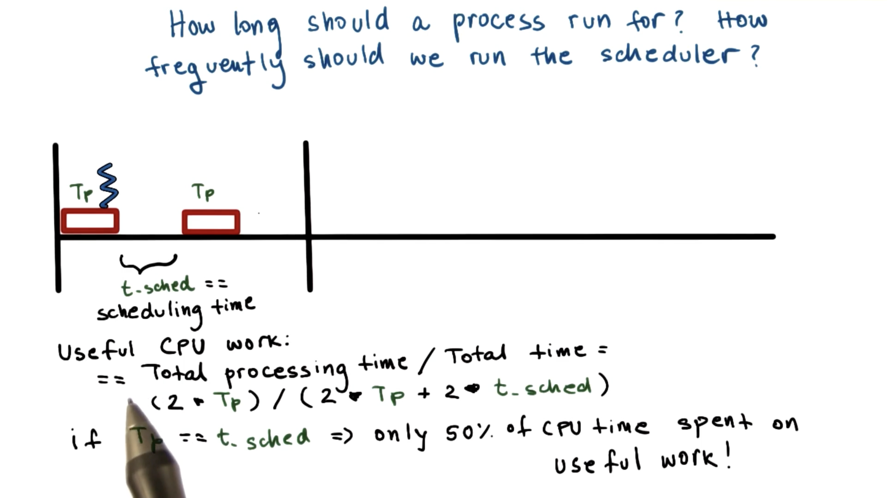

### Good Scheduling Efficiency

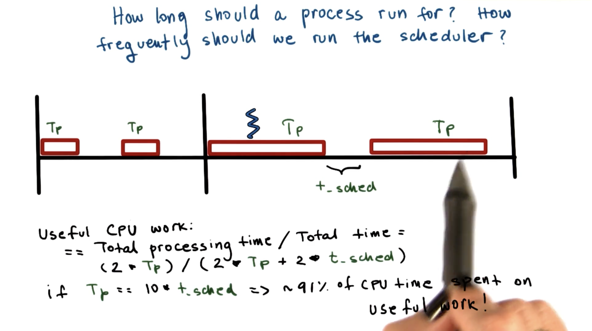

- Tp --> ***Timesclice*** time Tp allocated to a process on the CPU (the red stuff/bars)
    - what are approprocate time sclice values?
    - metrics to choose next process to run?

## I/O

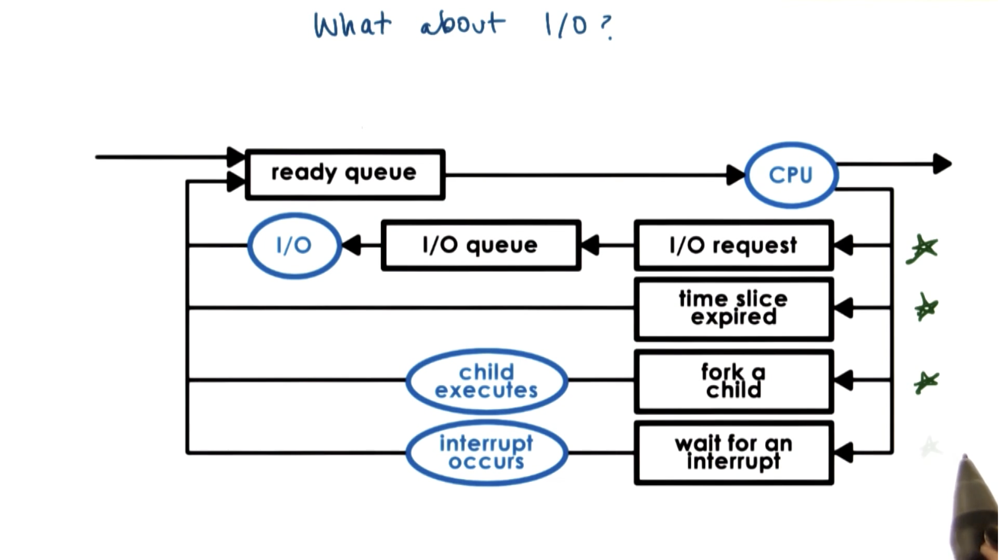

# Quiz 5

Which of the following are not a responsibility of the CPU scheduler?

- maintaining the I/O queue
- maintaining the ready queue
- decision on when to context switch
- decision on when to generate an event that a process is waiting on

### Answer

- maintaining the I/O queue
- decision on when to generate an event that a process is waiting on

## Inter Process Communication

***Can Processes interact?*** Yes.

An OS MUST provide mechanisms for processes to interact with one another.

In the modern scheme, more and more applications are structured as MULTIPLE processes that interact with one another

### ICP: Inter Process Communication

- Interprocess Communication Mechanisms: **IPC** 
    - Transfer data/info between address spaces
    - Maintain protection and isolation 
    - Provide flexibility and performance

Example: Message passing  ICP:

Suppose we have P1: Web Server, and P2: Database. The OS will maintain a "Buffer" where messages can be sent between these processes-> sending and receiving messages from one another for communication. A communication channel.

- OS provides communication channel like shared buffer between processes
- Processes
    - write: send
    - read: receive
    - messages to and from channel

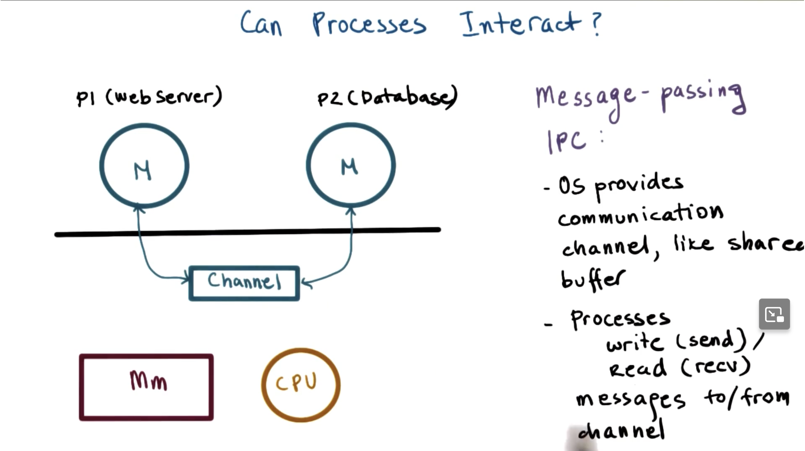

#### Advantanges

- Managed by operating system 
    - operating system provides exact same API and system calls for reading/writing from communication channel

#### Disadvantages

- Overhead
    - every single piece of information we want ot send between processes must be
        - copied from the user space of one of the processes
        - written into the channel/buffer which is sitting in ther Kernel memory of the OS
        - read back into the address space into the other process

### ICP: Shared Memory

- OS establishes a shared channel and maps it into each process address space
- Processes can read/write directly from this memory
- OS is **out of the way!**

#### Advantanges

- Less overhead
- OS does not get into the way of the application
- Faster communication channel between processes

#### Disadvantages

- Introduces additional complexity and possible errors within the application/processes.
- Since OS is out of the way, there are no strict/rigid/**well defined** APIs and access control mechanisms to read/write data between processes
    - more error prone
    - more complexity for developers

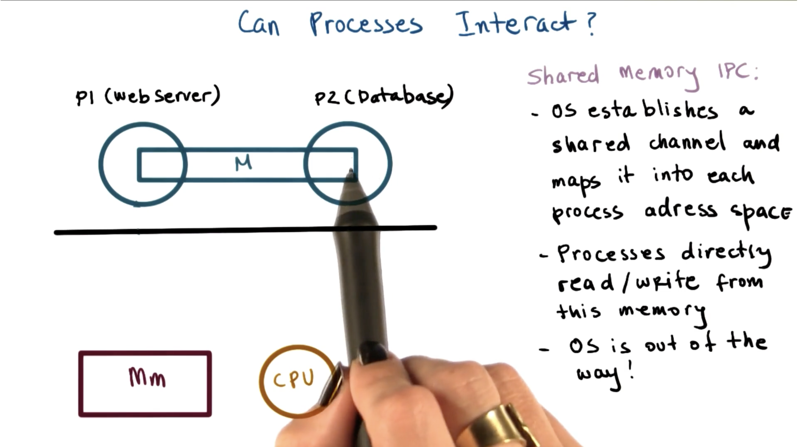

***It only makes sense to do shared memory based IPC if the setup cost can be amortized across a sufficiently large message set, since establishing the shared memory channel mapping is very expensive***

# Quiz 6

Shared memory based communication performs better than message passing communication

- True
- False
- It depends

### Answer

- It depends

*With shared memor based communication the data doesn't require that the data is copied in and out of the kernel, but the operation of **mapping data in between two processes is expensive**.*

*Only makes sense to do shared memory based communication if the setup cost of the operation is **amortized** accross a sufficiently large number of messages*
