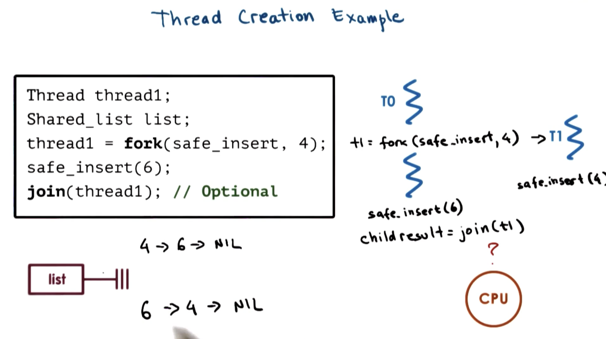

# Threads and Concurrency

*Single process with many execution contexts*

## Thread Metaphor

*A thread is like a worker in a toy shop

Toy Shop

---

- Active entity
    - Executing unit of a toy order
- Works simultaneously with others
    - Many workers completing toy orders
- Requires coordination between workers
    - Sharing of tools, parts, workstations

Threads

---

- Active entity
    - Execute a unit of work of a process
- Works simultaneously with others
    - Many threads executing at once to carry out a process
    - Concurrency is required
    - Can have multiple threads at the exact same time executing "concurrently"
- Requires coordination
    - Threads need to share I/O devices, CPUs, Memory, etc.

## Process vs Thread

*A single threaded process is represented by its address space. All of the data encapsulated in the PCB: stack pointer, program counter, code, data, files, reregisters, stack, heap, etc.*

A threads represent multiple independent execution contexts. They are apart of the same **virtual address space** so they share:
- Virtual to physical address mappings
- Code
- Data
- Files

Each thread contains its own:
- Registers
- Stack

Operating Systems that support processes with multiple threads have a more complex PCB (Process Control Block) data structure.
- Data shared among threads
    - Code
    - Data
    - Files
- Per thread execution contexts
    - Register
    - Stack


## Benefits of Multithreading

*At any given point of time there may be multiple threads of a given process running concurrently on a different processing unit of the CPU*

Its possible for each thread to execute the same code section with a subset of the overall input.

Since each thread has a different execution state it requires its own private copy of the stack, program counter, registers, etc.

### Panellization

*By parallelizing the process via breaking up the larger input into subsets carried out by each thread simultaneously, we speed up the time required to process the entire input.*

Threads can also execute different parts/aspects of the program
    - Create a thread specifically for I/O, Display Rendering, etc.
    - In the context of a web service application, different threads can handle different customer requests
        - By specializing threads to specific parts of application logic, we can customize each thread to optimize it's performance for the given task
            - Higher priority of threads that handle more important tasks

*Performance is dependent on how much state can be maintained in the CPU/Processor cache.*

If a given thread is executing a relatively small portion of the code base can lead to a higher percentage of the respective program state in cache --> **Optimizing HOT cache.**

### Are threads useful on a single CPU?

*When does # of threads > # of CPUs?*

If idle time is sufficiently longer than the time a context switch occurs, then it makes sense to perform a context switch and have `T1` wait for its Disk/IO operation while executing `T2`.

*Technically 2 context switches + some execution time for `T2` (since we have to context switch back to `T1` to resume state.*

Allows us to hide latency when waiting on long I/O operations.


### Apps and OS

By multithreading OS kernel, we allow OS to support multiple operating contexts (useful with multiple CPUs) so the OS context can operate concurrently on different CPUs in a multi processor/core environment.

The OS threads may run on behalf of a given user level service/application, or on behalf of the OS level service like a Daemon, device driver, etc.

# Quiz 1

Do the following statements apply to processes(P), threads(T) or both(B)?

- Can share a virtual address space
- Take longer to context switch
- Have an execution context
- Usually result in hotter caches when multiple exists
- Make use of some communication mechanisms

### Answer

- T
- P
- B
- T
- B

## Threads and Concurrency

### Thread Support

- Thread Data Structure
    - Identify threads
    - keep track of resource usage
- Mechanisms to **create** and **manage** threads
- Mechanisms to safely **coordinate** among threads running **concurrently** in the same address space

## Threads and Concurrency

### Processes

*There are issues when executing processes concurrently.* The Operating System ensures that each process has it's own addressing space. The OS and underlying hardware makes sure that there is no access provisioned from 1 address space to the other addressing space of a given process.

### Threads

*Threads provide a shareable address space between them.* This means that each threads has access to the same data and can both read/write to the same memory locations.

**What happens when T1 and T2 try to write data to the same block of memory?** This leads a inconsistencies and creates a **Data Race**. This is common in multi-threaded environment

## Synchronization Mechanisms

### Mutual Exclusion

- The operating system provides exclusive access to a memory location for only one thread at a time.
- Any other threads who want access to the same memory location must wait until the initial thread is finished.

### Mutex
- The Operating System handles this mutual exclusion of memory via **mutexes** 
- Mutexes allow a thread to lock a location of memory while it accesses it, ensuring *mutual exclusion remains* then unlocks the area of memory when its operations are complete.
- Another thread who is waiting for access can then request the mutex...

### Waiting

- Threads can wait on other threads
- Threads can wait on a *specific condition*
    - Example: in the event that one is holding a mutex lock on an area of memory it needs to access
- Condition variables are used to handle inter thread coordination.

## Thread Creation

### Thread Type

*Thread data structure*

Contains:
- Thread ID
- (PC) Program Counter
- (SP) Stack Pointer
- Registers
- Stack
- Attributes

### Fork

*fork(proc, args)*

**Creates a thread, NOT a Unix fork**

*When fork is called, a new thread is created, which means that a new thread data structure has been initialized for the new thread.*
- Program Counter will point to the first instruction of the program *proc*
- The *args* passed will be available on the Stack

*The "caller" T0 will execute the following instructions after the ***fork*** call. The thread that is spawned: T1, will execute the first instruction of the passed program i.e. ***proc****

*We also need a mechanisms for T1 to notify that it is done/complete with operation, as well as another mechanism to retrieve the end result of the program if required*

### Join

*join(thread_id)*

**Terminates the thread**

*When the parent thread calls **join** with the child **thread_id**, it will be blocked until the child completes. **join** will return the result of the child's computation.*

### Example



### Insert
```
create new list element e
set e.value = X
read list and list.p_next
set e.pointer = list.p_next
set list.p_next = e
```
- Problem when 2 threads try to update the pointer field of the first element in the list
    - Each thread will read the next element as `NULL` then set the next element to a specific value, one will overwrite the other.

## Mutual Exclusion

*In multithreading, we need mutual exclusion to properly support thread coordination*

### Mutex

*Threads must acquire a lock/mutex to access shared resources.*

- When a thread acquires a lock/mutex, it has *exclusive* access to the shared resource.
- Other threads attempting to access the shared resource will not be successful.
- Unease foul accesses to shared resources will be **blocked** when trying to access shared resources without the lock/mutex. They will be **suspended** until the lock/mutex has been released.
- **Data Structure design**:
    - bool: locked
    - int: owner
    - queue: blocked_threads


