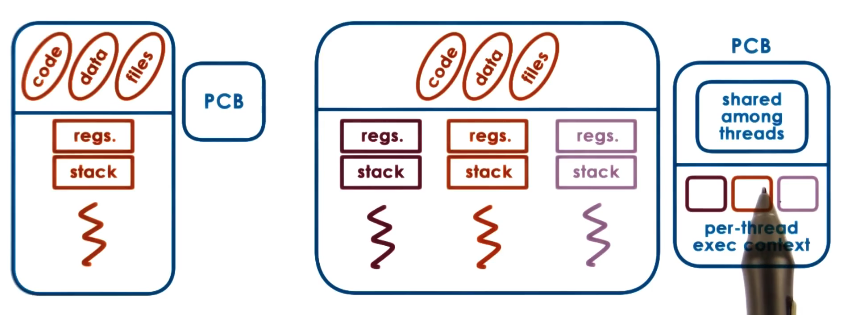
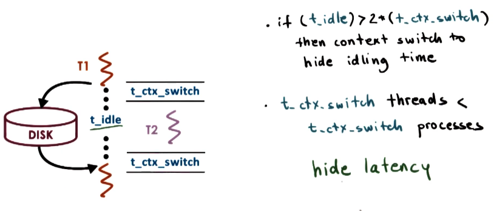

# Threads and Concurrency

*Single process with many execution contexts*

## Thread Methaphor

*A thread is like a worker in a toy shop

Toy Shop

---

- Active entity
    - Executing unit of a toy order
- Works simultaneously with others
    - Many workers completing toy orders
- Requires coordination between workers
    - Sharing of tools, parts, workdstations

Threads

---

- Active entity
    - Execute a unit of work of a process
- Works simultaneously with others
    - Many threads executing at once to carry out a process
    - Concurrency is required
    - Can have multiple threads at the exact same time executing "concurrently"
- Requires coordination
    - Threads need to share I/O devices, CPUs, Memory, etc.

## Process vs Thread

*A single threaded process is represented by its address space. All of the data encapsulated in the PCB: stack pointer, program counter, code, data, files, reregisters, stack, heap, etc.*

A threads represent multiple independent exeecution contexts. They are apart of the same **virtual address space** so they share:
- Virtual to physical address mappings
- Code
- Data
- Files

Each thread contains its own:
- Registers
- Stack

Operating Systems that support processes with multiple threads have a more complex PCB (Process Control Block) data structure.
- Data shared among threads
    - Code
    - Data
    - Files
- Per thread execution contexts
    - Register
    - Stack

## Benefits of Multithreading

*At any given point of time there may be multiple threads of a given process running concurrently on a different processing unit of the CPU*

Its possible for each thread to execute the same code section with a subset of the overall input.

Since each thread has a different execution state it requires its own private copy of the stack, program counter, registers, etc.

### Parrelization

*By parralelizing the process via breaking up the larger input into subsets carried out by each thread simultaneously, we speed up the time required to process the entire input.*

Threads can also execute different parts/aspects of the program
    - Create a thread specifically for I/O, Display Rendering, etc.
    - In the context of a web service application, different threads can handle differe customer requests
        - By specializing threads to specific parts of application logic, we can customize each thread to optimize it's performance for the given task
            - Higher priority of threads that handle more important tasks

*Performance is dependent on how much state can be maintained in the CPU/Processor cache.*

If a given thread is executing a relatively small portion of the code base can lead to a higher percentage of the respective program state in cache --> **Optimizing HOT chache.**

### Are threads useful on a single CPU?

*When does # of threads > # of CPUs?*

If idle time is sufficiently longer than the time a context switch occurs, then it makes sense to perform a context switch and have `T1` wait for its Disk/IO operation while executing `T2`.

*Technically 2 context switches + some execution time for `T2` (since we have to context switch back to `T1` to resume state.*

Allows us to hide latency when waiting on long I/O operations.

### Apps and OS

By multithreading OS kernel, we allow OS to support multiple operating contexts (useful with multiple CPUs) so the OS context can operate concurrently on different CPUs in a multi processor/core environment.

The OS threads may run on behalf of a given user level service/application, or on behalf of the OS level service like a Daemon, device driver, etc.

# Quiz 1

Do the following statements apply to processes(P), threads(T) or both(B)?

- Can share a virtual address space
- Take longer to context switch
- Have an execution context
- Usually result in hotter caches when multiple exists
- Make use of some communication mechanisms

### Answer

- T
- P
- B
- T
- B

