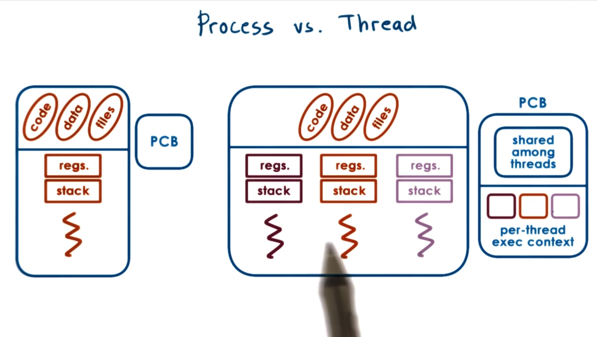

# Threads and Concurrency

### Threads

#### Metaphor

Like a worker in a toyshop

- Active entity
    - executing a unit of work that's required for an order/task
- Works simultaneously with others
    - many workers completing order/task
    - can be concurrent
- Requires coordination
    - sharing of tools, parts, workstations (resources)

### Process vs Threads

Single threaded process is represented by its address space. Which contains all the virtual to physical address mappings for the process:
- code
- data
- files
- heap
- section
- execution context
- values of registers
- stack pointer
- program counter

**All of the above information is represented in a process control block PCB**

#### Threads

Represent independent execution contexts. Each thread within a process is apart of the same virtual address space. They share all the code, data, and files.

They can potentially have different: 
- instructions
- access different parts of address space
- operate different parts of the user input

This means that each thread needs separate data structures for: 
- registers
- stack pointers

The PCB of a multi-threaded process is a more complex Process Control Block (PCB).



### Why are threads useful?

Threads can execute the same code but for a different input. Here are some ways to leverage multiple threads:

*Remember: Each thread requires its own copy of the stack and program counter.*

- **Parallelization -> Speeds up processing**
    - Perhaps you want to have each thread process chunks of the input in parallel.
    - This allows us to process the entire input much faster.

- Multi purpose process 
    - Perhaps you have a program handling different things: 
        - 1 thread for display rendering
        - 1 thread for input processing
        - etc.

- Specialization threads / Delegate functions
    - Different threads can handle different types of tasks/portions/functions of the program
    - Perhaps the process makes each thread perform different portions of the code respective to the functions they have been tasked with.
    - Can assign higher priority to threads that are handling more important tasks or serving clients.
    - Performance is dependent on how much state can be present in the processor cache.
        - If the code we are executing is more localized, it can result in a hotter cache
        which translates to gains in performance.

Q: ***Why not write a multi-processed application and delegate portions of application/system to each process?***

A: Because processes do not share any resources. This means the OS will have to allocate specific resources to each process like: 
- Addressing space
- Execution contexts

The difference here is the addressing space cost. A multi-threaded processes shares the same addressing space, whereas multi-processed will require individual addressing space.

Furthermore, communicating across processes or "synchronizing processes" requires **inter-process communication** mechanisms that are more costly/overhead than inter-thread. 

## Question: Are threads useful on a single CPU? Or when # of threads > # of CPUs?

Situation: Thread 1 makes a disk request. The disk request will require some *real-time* to move the disk spindle to get to the data and respond to the request. Let's call this *real-time* ***T1***

During ***T1*** The thread has no choice but to simply wait for the data retrieval. CPU is 
idle and does nothing.

If the idle time is substantially longer than making a context switch, then it makes sense to perform a context switch from ***T1*** to serve another thread like ***T2*** so we are doing 
something useful.

Technically, we would need to be waiting longer than 2 context switches, because we need to 
switch to ***TX*** and then back to ***T1***. 
```
if (t_idle)  > 2 * (t_ctx_switch)
```
One of the most costly things in `ctx_switch` is the time that is required to create the new virtual to physical addressing mappings for the new process that is taking place.

Since threads share an address space, when we context switch between threads, we don't need 
to perform any re-mapping. This cuts down on the overhead of `ctx_switch` costs with multi-threading vs multi-processes sing.

***Multi-threaded systems can hide more idle time during IO operations.***

### OS Kernel Leverages multi-threading as well

We've seen how user applications can benefit from multi-threading design, but kernel 
level programs can also benefit from the same design patterns.

We allow the Operating System to support multiple execution contexts which is particularly
useful when there are multiple CPUs. This allows the operating system to execute tasks 
concurrently on different CPUs on a multi process/multi-core platform.

- Threads working on behalf of user applications.
- OS level services like daemons or drivers.


### Process vs Thread Quiz

Do the following statements apply to Processes (P), Threads (T), or Both (B)?

- Can share a virtual address space
- Take longer to context switch
- Have an execution context
- Usually result in hotter caches when multiple exist
- Make use of some communication mechanisms

---

- T
- P
- B
- T
    - This is because threads share the virtual address space, that when multiple threads executed by 1 thread is already in the cache brought in from another thread.
- B

## What do we need to Support Threads?

- Thread data structure
    - Identify threads, keep track of resource usage
- Mechanisms to create and manage threads
- Mechanisms to safely coordinate among threads running in the space addressing space.
    - We need to ensure that threads do not overwrite the data from another.
    - We need to be able to wait on a thread to finish processing some arbitrary data/result to be used.

### Issues with concurrent execution

#### Processes

When processes run concurrently they each have their own addressing space. OS ensures that no access from address space for P1 is allowed be to performed/read/write from PX. 

 
